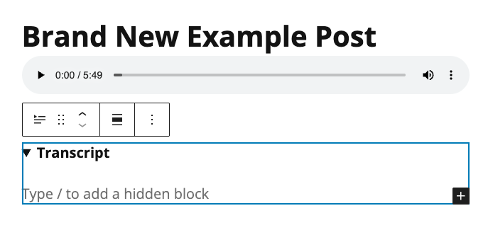

# Adding a Transcript to a Post

The **Transcript** block hides the transcript text by default. The transcript text appears when a user clicks the **Show/Hide** (triangle) button associated with the block.

1. If you haven't already done so, create a transcript of the project.
2. In a **WordPress Post**, click the **Add Block** button (plus sign.) Search for and select the **Transcript** block. The **Transcript** block will appear in the **Post**.
3. In the **Post**, click the **Show/Hide** (triangle) button in the **Transcript** block. A hidden block area will appear. Copy and paste the transcript text into this hidden block area. When finished, click the **Show/Hide** (triangle) button again to hide the hidden block area.
4. When you are done editing the **Post**, click **Save draft** or **Publish**.

<figure><figcaption>
A Transcript block in a WordPress Post.
</figcaption></figure>
