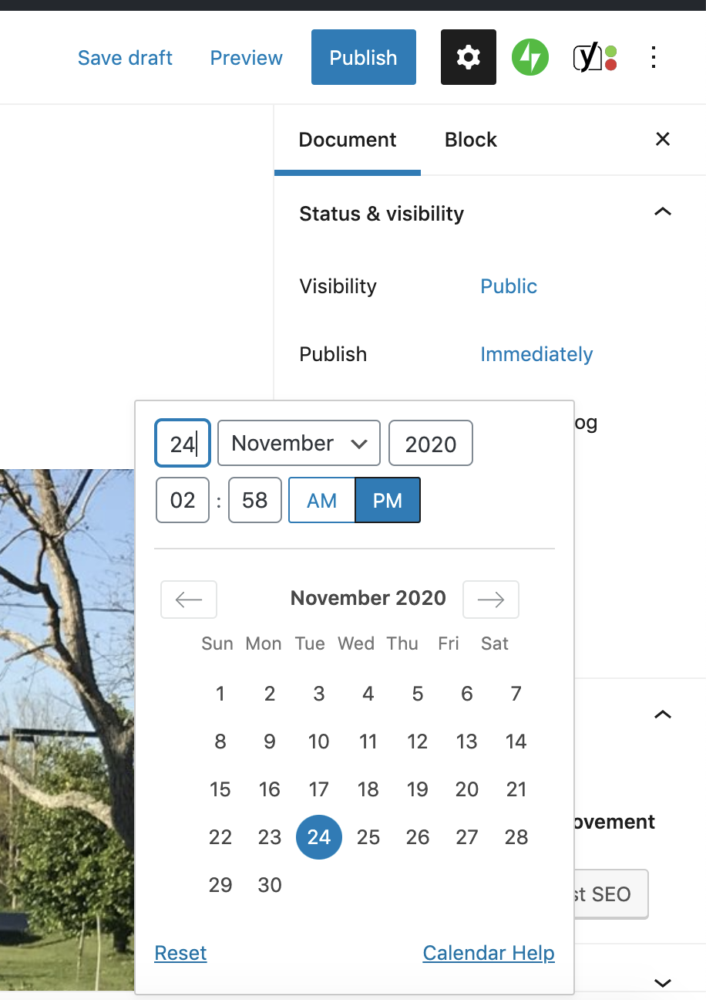

# Changing Publication Date and Time

#### Changing date and time of new post 

1. Make sure the **Document** tab is select in the **Setting** panel (on right.)
2. In the **Publish** area, click **Immediately**.
3. In the **calendar** interface, select a new date and time.
4. When finished, click **Publish**.

#### Changing date and time of existing post 

1. Make sure the **Document** tab is select in the **Setting** panel (on right.)
2. In the **Publish** area, click the post's publication date and time.
3. In the **calendar** interface, select a new date and time.
4. When finished, click **Publish**.

<figure><figcaption>
Setting the publication date and time for a post.
</figcaption></figure>
