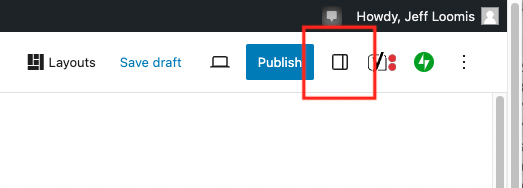

# Document and Block Tabs Don’t Appear on Right

**Problem**: **Document** and **Block** tabs don’t appear on right.

**Solution**: Click **Settings** button on right (see image below.)

<figure><figcaption>
Using WordPress Settings button to show right side panel.
</figcaption></figure>

