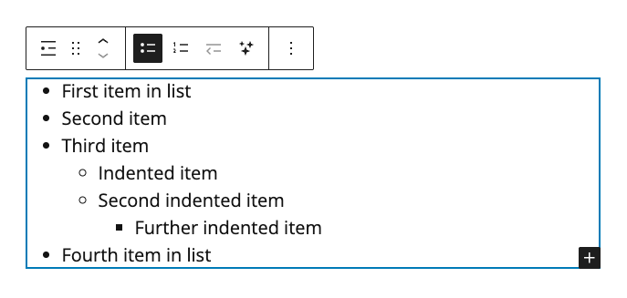

# Adding a Bulleted List

1. In a WordPress **Post**, click the **Add block** button (plus sign). Search for and select the **List** block. The **List** block will appear in the **Post**.
2. Click within the **List** block to add text to the list. By default, the **List** block will appear as a bulleted (unordered) list. Press **Enter** or **Return** (on keyboard) to add another bullet point to the list.
3. To create an indented bullet point, press **Enter** or **Return** to add a new bullet point. Then press the **Tab** key (on keyboard) to create an indented bullet point.
4. To un-indent a bullet point, press the **Delete** key (on keyboard).

<figure><figcaption>
Adding a bulleted list to a WordPress post.
</figcaption></figure>
