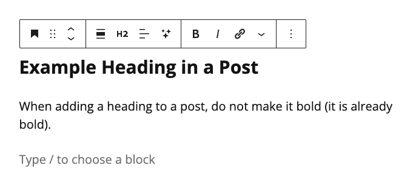

# Adding a Heading

Headings allow you to organize a post into different sections. When adding a heading to a post in Media Milwaukee, always choose **Heading 2 (H2.)**

1. In a post, click the **Add block** (plus sign) button and select **Heading**.
2. Click within the **Heading** block and make sure **H2** is selected. **Note**: Do not make the **Heading** bold (it is already bold).
3. Add your text to the **Heading** block.
4. Click **Save draft** when finished.

<figure><figcaption>
Adding a heading to a WordPress post.
</figcaption></figure>
