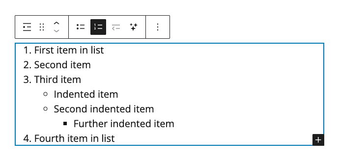

# Adding a Numbered List

1. In a WordPress **Post**, click the **Add block** button (plus sign). Search for and select the **List** block. The **List** block will appear in the **Post**.
2. By default, the **List** block will appear as a bulleted (unordered) list. To convert the list a numbered list, click the **Ordered** button in the **List block toolbar**.
3. Click within the **List** block to add text to the list.
4. To create an indented list item, press **Enter** or **Return** (on keyboard) to add a new list item. Then press the **Tab** key (on keyboard) to create an indented item.
5. To un-indent a list item, press the **Delete** key (on keyboard).

<figure><figcaption>
Adding a numbered list to a WordPress post.
</figcaption></figure>
