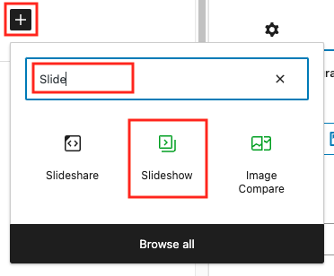

# Adding a Slideshow

#### Creating a slideshow 

1. If you haven't already done so, upload your images to the **Media Library**.
2. In a post, click the **Add block** button (plus sign.) Search for and select the **Slideshow** block (**Note**: Do not select **Slideshare** or **Image Compare**.)
3. In the **Slideshow** block, click **Select Images**. In the fly-out menu that appears, select **Media Library**.
4. In the **Media Library**, select all of the images you'd like to add your slideshow. A **checkmark** will appear in the upper-right corner of selected images. When finished, click **Create a new gallery**.
5. In the **Edit gallery** window, click and drag images to rearrange the order of the slideshow. Click within the **Caption** field to add a caption (or override an existing caption.) When finished, click **Insert gallery**.
6. To change the width of the slideshow within the post, click the slideshow to select it. Then use the [alignment options](aligning-and-resizing-an-image.md) to change the width of the slideshow. (Generally, the **Wide width** option is a good choice for slideshows.)

#### Editing a slideshow 

1. In the post, click the slideshow to select it.
2. Click the **Edit** button in the block toolbar.
3. In the **Edit gallery** window, make any necessary changes to your slideshow. When finished, click **Update gallery**.

<figure><figcaption>
Adding a slideshow to a post.
</figcaption></figure>
