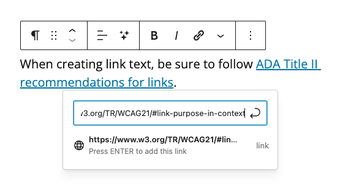

# Creating or Editing a Link

1. Open a new browser tab and go to the webpage you want to use in your link. (You can also create links to other **Posts** in Media Milwaukee.)
2. Copy the full **URL** of the webpage.
3. In a **Post**, drag-select the text you'd like to make into a link. **Note**: Link text should describe the webpage that will open when the link is clicked. Do not use phrases such as "click here" or "this link" when creating link text.
4. Click the **Link** button in the **text toolbar.**
5. Paste the URL in the **Search or type url** field. Click the **Submit** button (arrow.)

<figure><figcaption>
Adding a link to a WordPress Post.
</figcaption></figure>
