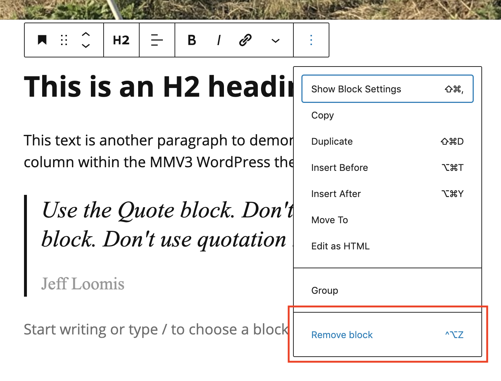

# Moving and Deleting Items in a Post

#### Moving an item 

1. Click a block in a post to select it.
2. In the block's toolbar, click the **Move up** button or **Move down** button.
3. When finished, click **Save draft**.

#### Deleting an item 

1. Click a block in a post to select it.
2. In the block's toolbar, click the **More options** (three dots) button. In the fly-out menu, choose **Remove block**.
3. When finished, click **Save draft**.

<figure><figcaption>
Removing a block from a post.
</figcaption></figure>
